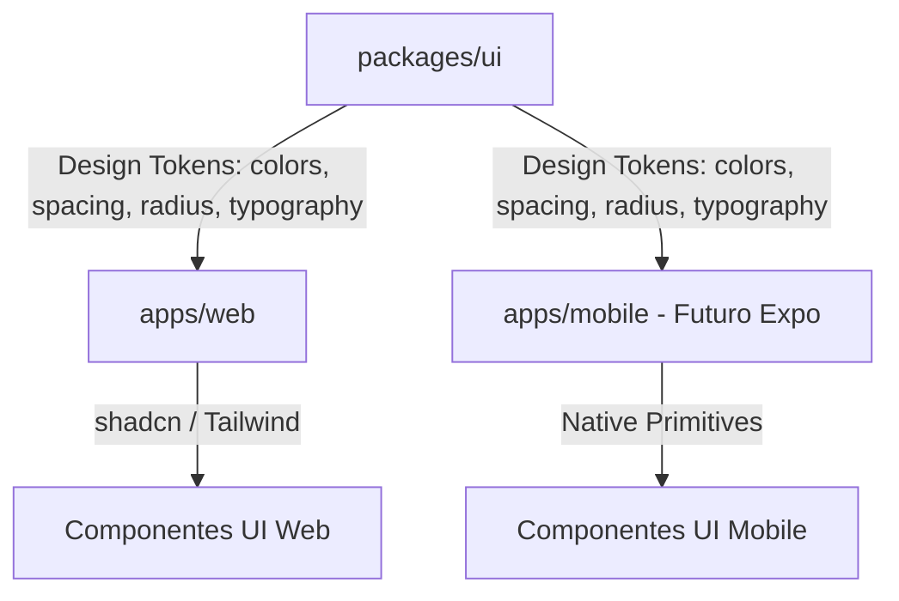

# Design System — PageLoom (Multiplataforma)

Este documento descreve as decisões de arquitetura de design, estrutura de arquivos, tokens de design e convenções de desenvolvimento do PageLoom. O objetivo é guiar desenvolvedores e agentes de IA de todas as plataformas para manterem o frontend coeso, escalável e reutilizável.

---

## 🎯 Visão Geral do Projeto & Prioridades

O PageLoom é um ecossistema de produtividade pessoal multiplataforma. A ordem de relevância de plataformas do projeto é:
1. **Android** (Prioridade Máxima)
2. **iOS** (Segunda prioridade)
3. **Desktop** (Terceira prioridade)
4. **Web** (Quarta prioridade)

Atualmente, estamos focados na arquitetura do **frontend**, estrutura de páginas, design tokens e fluxos de telas, utilizando a seguinte stack base:
- **Core UI**: React, TypeScript, Tailwind CSS v3
- **Componentes Base**: shadcn/ui (Radix UI primitives adaptados ao tema do projeto)
- **Playbook & Playground**: Storybook 8 (para documentação, testes visuais e desenvolvimento isolado)
- **Monorepo**: Workspaces npm (permitindo a coexistência de `apps/web`, `apps/api` e pacotes compartilhados em `packages/`)

---

## 🏗️ Arquitetura do Design System

Nossa arquitetura de design foi projetada para suportar a transição de um frontend web/desktop para aplicativos nativos de forma simples, baseando-se no conceito de **Design Tokens Singulares**.



### 1. Pacote Core de Tokens (`@pageloom/ui`)
Todos os tokens estruturais residem na pasta `packages/ui`. Eles servem como a única fonte de verdade de estilos e são exportados como objetos TypeScript estruturados. Isso permite que tanto a aplicação Web (usando CSS/Tailwind) quanto a aplicação Mobile (usando StyleSheet do React Native) consumam os mesmos tokens.

- **Colors (`packages/ui/src/tokens/colors.ts`)**: Paleta de cores da marca, neutros e semânticos.
- **Typography (`packages/ui/src/tokens/typography.ts`)**: Fontes (serifada do planner, sans-serif do painel), escalas de tamanho e pesos.
- **Spacing (`packages/ui/src/tokens/spacing.ts`)**: Escala de espaçamento padrão com base de `4px`.
- **Radius (`packages/ui/src/tokens/radius.ts`)**: Definições de arredondamento de bordas.

### 2. Estilos Globais e Tailwind CSS (`apps/web`)
O Tailwind no frontend Web é configurado em `apps/web/tailwind.config.js` para consumir diretamente as variáveis CSS declaradas no `apps/web/src/styles/theme.css`, integrando-se perfeitamente com os tokens de design.

---

## 📁 Estrutura de Diretórios de Frontend

Para garantir a escalabilidade e o reaproveitamento máximo de código, as pastas de componentes e páginas de `apps/web` são organizadas sob uma estrutura atômica rígida:

```
apps/web/
├── .storybook/              # Configurações do Storybook, incluindo viewports e decoradores
├── src/
│   ├── app/                 # Páginas e Telas principais da aplicação
│   │   ├── App.tsx          # Ponto de entrada do App, orquestrador de estado e telas
│   │   └── screens.tsx      # Telas encapsuladas (LibraryScreen, ShelfDetailScreen, etc.)
│   ├── components/
│   │   ├── ui/              # Componentes puros de fundação (gerados/inspirados no shadcn/ui)
│   │   │                    # Exemplos: button.tsx, dialog.tsx, sheet.tsx, badge.tsx
│   │   ├── modals/          # Modais de fluxo de negócios isolados da lógica da página
│   │   │                    # Exemplos: CreateChoiceModal.tsx, NewShelfModal.tsx
│   │   ├── layout/          # Estruturas persistentes da interface (TopBar, BottomTabBar, SidebarNav)
│   │   ├── bookshelf/       # Lógica visual e interativa da estante (BookFocusOverlay, etc.)
│   │   └── planner/         # Módulos específicos do planejador de páginas e miolos
│   ├── lib/
│   │   └── utils.ts         # Utilitários globais do frontend (cn helper para concatenação de classes)
│   ├── stories/             # Playbook de documentação isolada do Storybook
│   │   └── ui/              # Histórias dos componentes shadcn (Button.stories.tsx, etc.)
│   └── styles/
│       ├── theme.css        # Variáveis nativas de design tokens do PageLoom
│       └── global.css       # Configurações globais do Tailwind e resets do browser
```

---

## 🎨 Componentes Fundacionais (shadcn/ui)

Os componentes de UI básicos residem em `src/components/ui/` e são exportados de forma centralizada pelo barrel file `index.ts`. Eles devem ser agnósticos à lógica de negócios.

### Componentes Disponíveis:
1. **Button**: Botão básico com suporte a variantes (`default`, `secondary`, `outline`, `destructive`, `ghost`, `link`) e tamanhos (`default`, `sm`, `lg`, `icon`).
2. **Input**: Caixa de texto estilizada.
3. **Textarea**: Caixa de texto multilinha com estilo unificado.
4. **Badge**: Rótulos e marcadores visuais.
5. **Separator**: Linhas divisórias horizontais ou verticais consistentes.
6. **Dialog**: Modais centralizados de alta relevância (padrão desktop/tablet).
7. **Sheet**: Gaveta lateral ou inferior (Bottom Drawer - padrão mobile).
8. **Tabs**: Navegador de abas horizontais estruturado.
9. **Skeleton**: Componente de feedback para carregamento assíncrono.
10. **Tooltip**: Dicas rápidas de ferramentas em hover/foco.
11. **DropdownMenu**: Lista suspensa de opções e ações.
12. **Select**: Menu seletor estilizado.

---

## 📚 Storybook Playbook & Viewports

O Storybook é utilizado para testar a adaptabilidade de cada componente nas diferentes plataformas e modos de visualização.

### Viewports Pré-configurados:
No arquivo `.storybook/preview.tsx`, configuramos viewports explícitos para as três prioridades de layout do PageLoom:
- **Mobile (iPhone 14/15)**: `390px` de largura. Foco total em layout compactos de toque, gavetas inferiores (`Sheet` com `side="bottom"`) e `BottomTabBar`.
- **Tablet (iPad Air)**: `768px` de largura. Layout híbrido, testando se a barra lateral e os grids de livros se comportam bem.
- **Desktop (1280px)**: `1280px` de largura. Experiência de visualização estendida em tela cheia e menus suspensos (`DropdownMenu`).

---

## 🤖 Guia de Desenvolvimento para Agentes de IA

Ao criar novos recursos ou refatorar componentes no PageLoom, você **deve** seguir as regras abaixo:

1. **Agnosticismo de Estilos nos Primitivos**: Ao criar ou estender componentes em `components/ui/`, garanta que eles não tenham lógica de negócios ou estados específicos de páginas. Use variáveis CSS e tokens em TypeScript.
2. **Separação de Modais**: Não declare modais ou painéis complexos inline nos arquivos de telas ou no `App.tsx`. Isole-os na pasta `components/modals/`. Crie propriedades de controle (`isOpen`, `onClose`) transparentes e retorne os inputs ou submissões via callbacks (e.g., `onCreateShelf`).
3. **Stories para Tudo**: Ao criar um componente UI em `components/ui/` ou um componente persistente, crie o respectivo story em `src/stories/ui/` ou `src/stories/components/`. Isso garante que possamos validar os estados visuais antes do deploy.
4. **Respeito às Cores e Design**: Use as cores do tema PageLoom (e.g., `var(--color-bg)`, `var(--color-accent)`, `var(--color-text)`) em vez de classes arbitrárias do Tailwind (como `bg-red-500` ou `text-blue-600`), garantindo que o visual premium e rústico do planner digital seja mantido em todas as telas.
