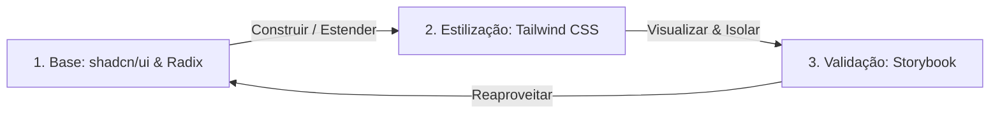

# Workflow de Desenvolvimento de Componentes — PageLoom

Este guia define o fluxo de trabalho (workflow) padrão para a criação, organização, teste e documentação de componentes, modais e páginas no projeto PageLoom. Ele é baseado na combinação de três ferramentas fundamentais: **Tailwind CSS + shadcn/ui + Storybook**.

Seguir este workflow garante que o frontend permaneça modular, reutilizável e com alta adaptabilidade multiplataforma (Android, iOS, Desktop e Web).

---

## 🔄 O Workflow de 3 Passos (Tailwind + shadcn + Storybook)

Sempre que precisar criar um novo elemento de interface ou refatorar um existente, você deve seguir este fluxo contínuo:



### Passo 1: Fundação com shadcn/ui & Radix Primitives
Não reinvente a roda. Comece o componente utilizando os primitivos do shadcn (Radix UI) que já possuem excelente acessibilidade (WAI-ARIA), foco nativo e comportamento robusto.

- **Se o componente base não existir**: Crie um novo arquivo em `src/components/ui/` utilizando as Radix Primitives apropriadas (ex: `@radix-ui/react-tooltip` para tooltips).
- **Se o componente base já existir**: Use as bases já existentes (Button, Input, Badge, etc.) e crie wrappers específicos de negócios nas outras pastas se necessário.

### Passo 2: Estilização com Tailwind CSS & Design Tokens
Aplique a camada de estilo do PageLoom utilizando as utilidades do Tailwind CSS v3 e os tokens nativos do projeto.

- **Utilize variáveis CSS de Tema**: Sempre prefira usar as cores mapeadas no tema do projeto (ex: `bg-background`, `text-foreground`, `border-input`, `var(--color-accent)`) para manter o estilo premium e rústico do planner digital.
- **Variantes e Estados**: Use o `class-variance-authority` (cva) para criar componentes com múltiplas variantes (como o `Button` e `Badge`), garantindo facilidade de uso em qualquer tela.

### Passo 3: Isolamento, Validação e Teste com Storybook
Antes de integrar o componente em uma tela do sistema, crie seu arquivo de história (`*.stories.tsx`) em `src/stories/` para validá-lo de forma 100% isolada das lógicas de negócio do banco de dados ou estados globais.

- **Teste Adaptativo de Viewports**: Use a barra de ferramentas do Storybook para alternar o componente entre os modos **Mobile**, **Tablet** e **Desktop** para garantir que a renderização seja adequada em todas as plataformas (respeitando a ordem de importância: Android → iOS → Desktop → Web).
- **Controles Dinâmicos (Controls)**: Configure os argumentos (`args`) e controles no Storybook para permitir a alteração dinâmica de propriedades como textos, ícones, tamanhos e variantes direto no painel do Storybook.

---

## 🧱 Como Organizar Componentes, Modais e Páginas

Para evitar acúmulo de lógica e arquivos gigantescos (como os antigos `App.tsx` e `screens.tsx`), a divisão de responsabilidades de frontend segue o seguinte padrão rígido:

### 1. Componentes Primitivos (Atoms)
- **Local**: `src/components/ui/`
- **Características**: São puramente visuais e funcionais genéricos. Não possuem qualquer dependência de estado global do app (como shelves ou activeBook) ou lógicas do Supabase. São estilizados com Tailwind e exportados via `components/ui/index.ts`.
- **Exemplo**: `button.tsx`, `separator.tsx`, `skeleton.tsx`.

### 2. Modais e Fluxos Isolados (Organisms)
- **Local**: `src/components/modals/`
- **Características**: Encapsulam modais de fluxos de negócios completos. Não devem ser declarados inline no `App.tsx` ou nas telas. Devem exportar props de controle transparentes (`isOpen`, `onClose`) eCallbacks de retorno (ex: `onCreateShelf: (name: string) => void`).
- **Exemplo**: `CreateChoiceModal.tsx`, `NewShelfModal.tsx`.

### 3. Estruturas Visuais Persistentes (Templates)
- **Local**: `src/components/layout/`
- **Características**: Componentes que compõem o grid/frame da aplicação e guiam a navegação do usuário. Devem se adaptar dinamicamente ao modo compacto (mobile) e estendido (desktop).
- **Exemplo**: `TopBar.tsx`, `BottomTabBar.tsx`, `SidebarNav.tsx`.

### 4. Telas e Páginas (Pages)
- **Local**: `src/app/screens.tsx` ou `src/app/`
- **Características**: Telas cheias que orquestram os dados e componentes primitivos. Elas escutam o Supabase ou estados globais do monorepo, manipulam coleções de dados e delegam interações aos modais.
- **Exemplo**: `LibraryScreen`, `PlannerScreen`.

---

## 📈 Exemplo Prático de Desenvolvimento (Criação de um Novo Modal)

Caso você precise adicionar um modal de confirmação de exclusão de livro no planner, siga este passo a passo:

1. **Crie o arquivo do Modal**:
   Crie `src/components/modals/ConfirmDeleteBookModal.tsx`. Use o primitivo `Dialog` do shadcn em vez de backdrops manuais de CSS:
   ```tsx
   import React from "react";
   import { Dialog, DialogContent, DialogHeader, DialogTitle, DialogDescription, DialogFooter } from "../ui/dialog";
   import { Button } from "../ui/button";

   interface ConfirmDeleteBookModalProps {
     isOpen: boolean;
     onClose: () => void;
     onConfirm: () => void;
     bookTitle: string;
   }

   export function ConfirmDeleteBookModal({ isOpen, onClose, onConfirm, bookTitle }: ConfirmDeleteBookModalProps) {
     return (
       <Dialog open={isOpen} onOpenChange={onClose}>
         <DialogContent>
           <DialogHeader>
             <DialogTitle>Excluir Planner?</DialogTitle>
             <DialogDescription>
               Tem certeza que deseja excluir "{bookTitle}"? Essa ação não pode ser desfeita.
             </DialogDescription>
           </DialogHeader>
           <DialogFooter>
             <Button variant="ghost" onClick={onClose}>Cancelar</Button>
             <Button variant="destructive" onClick={onConfirm}>Excluir</Button>
           </DialogFooter>
         </DialogContent>
       </Dialog>
     );
   }
   ```

2. **Crie o Story no Storybook**:
   Crie `src/stories/ui/ConfirmDeleteBookModal.stories.tsx` para testar os estados aberto/fechado e texturas em dispositivos móveis:
   ```tsx
   import type { Meta } from "@storybook/react";
   import { ConfirmDeleteBookModal } from "../../components/modals/ConfirmDeleteBookModal";

   const meta: Meta = {
     title: "Modals/ConfirmDeleteBookModal",
     component: ConfirmDeleteBookModal,
   };

   export default meta;

   export const Default = {
     args: {
       isOpen: true,
       bookTitle: "Minha Agenda 2026",
       onClose: () => {},
       onConfirm: () => {},
     },
   };
   ```

3. **Exporte e Integre na Tela**:
   Adicione o export em `components/modals/index.ts` e declare o modal em `LibraryScreen` ou `ShelfDetailScreen` de forma limpa, alterando um estado booleano simples para controlar a renderização.

---

## 🛠️ Comandos Úteis no Workflow

- **Iniciar Storybook para Desenvolvimento**:
  ```bash
  npm run storybook -w @pageloom/web
  ```
- **Compilar e Validar Tipos**:
  ```bash
  npm run build -w @pageloom/web
  ```
- **Executar o App Localmente**:
  ```bash
  npm run dev -w @pageloom/web
  ```
