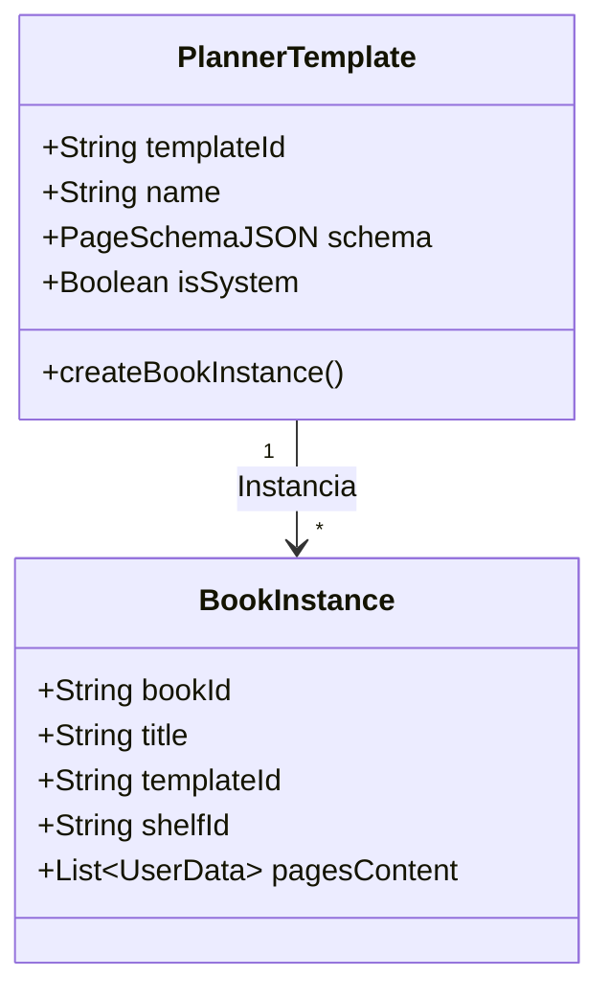

# Arquitetura de Produto & Crossover Físico-Digital — PageLoom

Este documento detalha o planejamento estratégico de produto, fluxo de negócios e arquitetura técnica para o ecossistema **PageLoom** — uma plataforma inovadora que une planners físicos impressos personalizados com um aplicativo digital de produtividade ativa.

---

## 🎯 O Conceito PageLoom Flywheel (Físico ⇄ Digital)

O PageLoom não é apenas um app ou um e-commerce de papelaria; é um ecossistema fechado que resolve o atrito entre o prazer da escrita manual e a conveniência dos lembretes e buscas do digital.

```
       [ PageLoom Studio (Web Desktop) ]
       Criação de planners arrasta-e-solta
                       │
                       ▼
         [ Impressão & Entrega Física ]
        Com furação para caderno inteligente
                       │
                       ▼
       [ QR Code Impresso com ID Único ]
                       │
                       ▼
    [ Leitura pelo App PageLoom (Android/iOS) ]
   Gera instantaneamente a réplica digital idêntica
                       │
                       ▼
      [ Sincronização e Calendário Ativo ]
     Notificações, busca e agenda integrada
```

### Monetização Dupla:
1. **Físico (E-commerce / D2C)**: Venda unitária de refis de folhas e planners impressos sob demanda de alta qualidade, com furações customizadas (Caderno Inteligente, Fichário, Espiral).
2. **Digital (SaaS / Assinatura)**: Assinatura recorrente para uso do app de produtividade avançado (reconhecimento de escrita, busca indexada, sincronização com agendas virtuais e Google Calendar).

---

## 🏗️ Análise de Solução: App Único vs. Apps Separados

A decisão de **UX e Plataforma** ideal para as duas pontas do produto é:

### 1. PageLoom Studio (O Criador)
- **Foco de Plataforma**: **Web Desktop** (`studio.pageloom.com`).
- **Raciocínio**: A criação de layouts arrasta-e-solta no estilo Elementor/Canva exige telas grandes, precisão de clique/mouse, painéis de controle laterais ricos e facilidade para inspecionar medidas reais em milímetros. Tentar fazer isso em uma tela de celular seria frustrante para o usuário.
- **Integração**: Web App PWA que pode rodar em tablets, mas otimizado para desktop.

### 2. PageLoom App (O Companheiro de Produtividade)
- **Foco de Plataforma**: **Mobile (Android/iOS)** e **Web Compacta**.
- **Raciocínio**: É o companheiro diário do usuário. Ele precisa estar no bolso para consultas rápidas, marcação de tarefas concluídas, digitalização de anotações físicas usando a câmera do celular (para ler o QR Code ou tirar foto das folhas) e notificações push (integração com Google Calendar).

---

## ⚙️ A Chave da Integração: O "Page Schema" JSON

Para que o designer web envie um PDF de alta resolução para a impressora industrial e, ao mesmo tempo, desenhe o mesmo planner idêntico na tela do smartphone do usuário, o sistema compartilhará um formato de dados único: o **Page Schema JSON**.

Esse esquema de dados reside em `packages/shared` para ser consumido tanto pelo Studio Web quanto pelo App Mobile.

### Exemplo Teórico do Schema (`PageLayout`):
```json
{
  "plannerId": "pl-2026-user99-xyz",
  "name": "Meu Planner de Metas 2026",
  "dimensions": {
    "format": "A5",
    "widthMm": 148,
    "heightMm": 210,
    "marginMm": { "top": 12, "bottom": 12, "left": 18, "right": 12 }
  },
  "pages": [
    {
      "pageIndex": 1,
      "title": "Visão Diária de Performance",
      "gridBlocks": [
        {
          "id": "block-time-blocking",
          "type": "time_blocking",
          "x": 0, "y": 0, "w": 6, "h": 12,
          "properties": {
            "startHour": 7,
            "endHour": 22,
            "intervalMinutes": 30
          }
        },
        {
          "id": "block-priorities",
          "type": "checkbox_list",
          "x": 6, "y": 0, "w": 6, "h": 6,
          "properties": {
            "title": "Prioridades do Dia",
            "maxItems": 3
          }
        },
        {
          "id": "block-water-tracker",
          "type": "counter",
          "x": 6, "y": 6, "w": 6, "h": 6,
          "properties": {
            "title": "Hidratação",
            "target": 8,
            "unit": "copos"
          }
        }
      ]
    }
  ]
}
```

---

## 🗂️ O Conceito de Templates Reutilizáveis de Miolo

No ecossistema PageLoom, há uma separação clara de domínios entre a **Definição de Design** (Template) e a **Instância de Trabalho** (Livro/Planner preenchido pelo usuário).



### Como funciona na prática:
1. **Biblioteca de Templates Pessoais**:
   Ao criar um design customizado de páginas e blocos no Studio Web (ou sincronizar um planner impresso via QR Code), ele é registrado no banco de dados do usuário como um **Template Personalizado**.
2. **Reaproveitamento Ilimitado**:
   O usuário pode usar o **mesmo template** para instanciar múltiplos livros ou planners independentes em sua estante.
   - *Exemplo*: Um mesmo template "Performance A5 com Time Blocking" criado pelo usuário pode ser usado para instanciar um livro chamado "Trabalho 2026", outro chamado "Estudos Faculdade" e outro para "Metas Pessoais".
3. **Instanciação com Separação de Dados**:
   A estrutura dos blocos (grades, horários, tipos de contadores) é herdada do Template, mas os dados inseridos (as anotações diárias, metas marcadas, copos de água contados) pertencem única e exclusivamente àquela **Instância de Livro** específica. Isso garante leveza ao banco de dados e flexibilidade total.

---

## 📂 Arquitetura Técnica do Monorepo Expandido

Para suportar essa visão modular de forma frontend-first, sugerimos a seguinte estrutura de workspaces:

```
pageloom/
├── apps/
│   ├── app-mobile/        # React Native + Expo (Android & iOS)
│   │                      # Leitor de QR Code, agenda virtual, notas rápidas, sincronização
│   ├── app-studio/        # React + Vite (Web Desktop)
│   │                      # Editor arrasta-e-solta, renderizador de miolo, e-commerce checkout
│   └── api/               # Supabase Edge Functions & Webhooks (Backend)
│                          # Geração de PDFs de alta resolução, processamento de pedidos, integrações de APIs externas
├── packages/
│   ├── shared/            # Modelos de dados e validações (ex: Page Schema JSON, contratos)
│   └── ui/                # Componentes puros de tokens JS compartilhados entre Studio e Mobile
```

---

## 🚀 Fluxo de Sincronização Ativa (O QR Code do Planner)

1. **No Studio Web**: 
   Ao finalizar e fechar a compra do planner físico, o sistema grava o JSON do design no Supabase sob um `planner_id` criptografado (ex: `quapixepnrmwpzpnpsmi/planners/12345`).
2. **Na Produção Gráfica**:
   O backend compila o JSON em um arquivo PDF vetorial de alta definição para impressão. No cabeçalho ou rodapé da primeira folha, um QR Code contendo a URL `https://app.pageloom.com/sync?id=12345` é impresso discretamente.
3. **No Celular do Usuário**:
   Ao receber o planner, ele abre o app PageLoom e aponta a câmera para o QR Code. O app lê o ID `12345`, puxa o JSON correspondente do banco e cria uma réplica digital interativa exata dentro da biblioteca digital do usuário.
4. **Na Agenda Ativa**:
   Os blocos do tipo "agenda/compromissos" que o usuário configurou no planner impresso ganham vida no app. O usuário pode digitar ou ditar compromissos no app digitais que sincronizam com a nuvem, mantendo lembretes ativos no celular dos horários anotados no papel físico.

---

## 📐 A Física da Folha: Proporção, Escala SVG e Alinhamento de Pauta

Para que o crossover físico-digital seja de altíssima fidelidade, a relação de proporções entre a folha impressa em papel e a folha digital na tela do celular/tablet deve ser rigorosamente de **1:1**.

```
    [ Papel Físico A5 ]                     [ App Digital (Tela) ]
    • Largura: 148mm                        • Largura: Escalável (CSS/SVG)
    • Altura: 210mm                         • Altura: Mantém Proporção 1:1.414
    • Pauta Clássica: 7mm                   • Altura da Pauta: Equivalente a 7mm
    • Escrita à mão física                  • Fontes digitais travadas no baseline
```

### 1. Renderização em SVG Dinâmico (Milímetros Reais)
Para anular a disparidade de pixels entre diferentes telas (e.g., iPhone Pro Max vs. Tablet Android antigo), o layout de cada miolo é renderizado como um elemento **SVG (Scalable Vector Graphics)**.
- A `viewBox` do SVG é definida usando as medidas físicas do papel em milímetros. Por exemplo, para uma folha A5:
  ```xml
  <svg viewBox="0 0 148 210" width="100%" height="100%">
     <!-- Onde 1 unidade no SVG equivale exatamente a 1 milímetro físico! -->
  </svg>
  ```
- O navegador e o aplicativo móvel usam CSS `aspect-ratio: 148 / 210` e `object-fit: contain` para garantir que a folha digital se expanda e se contraia perfeitamente na tela, mantendo a geometria intacta.

### 2. O Alinhamento da Pauta Digital
Escrever no papel físico é limitado por pautas físicas de aproximadamente **`7mm`** a **`8mm`** de altura. Para que o texto digitado via teclado no app caia **exatamente** em cima das pautas do papel:
- **Espaçamento de Linha Travado (`Line Height Sizing`)**: O editor de texto digital (HTML/Rich-Text) tem sua propriedade `line-height` estritamente calculada para bater com os `7mm` proporcionais da `viewBox` do SVG.
- **Tamanhos de Fontes Travados de Fábrica**: O usuário **não pode** alterar livremente o tamanho da fonte do texto para qualquer valor arbitrário. As fontes são pré-computadas para simular tamanhos normais de caligrafia (escrita a caneta fina a média):
  - **Título Principal (H1)**: Ocupa exatamente `3 pautas` de altura (`21mm` no SVG).
  - **Subtítulo (H2)**: Ocupa exatamente `2 pautas` de altura (`14mm` no SVG).
  - **Texto de Corpo/Anotação (Parágrafo)**: Ocupa exatamente `1 pauta` de altura (`7mm` no SVG), com tamanho de fonte fixo de `13px` a `14px` (equivalente visual a uma escrita média).
- **Alinhamento no Baseline**: O texto digital usa alinhamento à linha de base (`vertical-align: baseline`), garantindo que a base das letras (como 'a', 'e', 'c') encoste perfeitamente na pauta do SVG de fundo, simulando a escrita real em papel pautado.

### 3. Tipografia Premium e Escrita Orgânica
Para acentuar a sensação tátil do planner físico na tela do app, a biblioteca de fontes digitais do aplicativo inclui fontes elegantes de estilo manuscrito (*handwritten/sans-organic*) como **Outfit**, **Cormorant Garamond** (serifa clássica de planner) e fontes cursivas suaves para títulos, mantendo sempre a escala travada e coerente com a folha impressa.

---

## 📄 Estilos de Folha, Máscaras de Bloco e Títulos Dinâmicos

Para permitir versatilidade total na criação dos miolos sem comprometer a clareza visual, o sistema de renderização de páginas do PageLoom opera com camadas inteligentes.

### 1. Tipos de Textura de Fundo (Camada Base)
Tanto para a impressão física de refis quanto para a visualização na tela do aplicativo, o usuário pode escolher entre quatro padrões tradicionais de papelaria:
- **Papel em Branco (Blank)**: Ausência de guias visuais, ideal para colagens, desenhos livres e layouts ultra-customizados.
- **Papel Pautado Clássico (Ruled)**: Linhas horizontais clássicas com espaçamento estrito de `7mm`, fornecendo guias para escrita cursiva longa.
- **Papel Pontilhado (Dotted)**: Uma grade de micro-pontos equidistantes (`5mm` de espaçamento). É o padrão preferido de entusiastas de *Bullet Journal*, pois dá o alinhamento da pauta sem a poluição visual das linhas cheias.
- **Papel Quadriculado (Grid)**: Grade quadriculada de `5mm x 5mm`, ideal para planners técnicos, tabelas e gráficos.

### 2. A Solução para Conflito Visual: Máscaras de Bloco Opacas (`Opaque Block Masking`)
Se o usuário escolher uma folha de fundo **Pautada** ou **Pontilhada** e adicionar um bloco funcional (ex: uma lista de tarefas ou um rastreador de hábitos), as linhas de pauta passando por trás do bloco criariam um caos visual. 

Para resolver isso de forma elegante:
- Todos os blocos interativos arrastados pelo usuário possuem um **fundo sólido opaco (`fill="var(--color-bg)"`)**.
- Ao ser posicionado na página, o bloco atua como uma **máscara física**, encobrindo automaticamente os pontos ou as pautas da camada de fundo naquela coordenada exata.
- As linhas de pauta e pontos continuam aparecendo perfeitamente no restante das áreas livres da folha, criando uma integração suave e orgânica.

```
+------------------------------------------+
|  pautas... pautas... pautas... pautas... |
|  pautas... pautas... pautas... pautas... |
|  pautas... +------------------+ pautas...|
|  pautas... | [ ] Bloco Opaco  | pautas...|  <-- Máscara oculta a pauta de fundo
|  pautas... | [ ] Sem Pautas   | pautas...|
|  pautas... +------------------+ pautas...|
|  pautas... pautas... pautas... pautas... |
+------------------------------------------+
```

### 3. Anatomia dos Blocos: Títulos Pré-Impressos vs. Espaços em Branco
O design dos blocos é classificado em dois tipos funcionais para equilibrar estrutura estética e liberdade de escrita:

#### A. Blocos Semânticos de Estrutura (Títulos Flexíveis/Pré-definidos)
São blocos como "Citações do Dia", "Lista de Tarefas" ou "Gratidão".
- **Comportamento**: Ao adicionar o bloco, ele vem com um título padrão sugerido ("Citações"). No **Studio Web (Desktop)**, o usuário pode clicar e editar este título para o que quiser.
- **Versão Física (Impressa)**: O título escolhido pelo usuário é impresso de forma permanente e elegante no cabeçalho do bloco usando a tipografia cursiva premium do sistema.
- **Versão Digital (App)**: O cabeçalho exibe o mesmo título estático e deixa a área interna livre para entrada de dados.

#### B. Blocos de Controle e Registro (Campos em Branco)
São blocos de controle temporal ou métrico (ex: Data Completa, Dia da Semana, Rastreador de Humor, Copos de Água).
- **Comportamento**: Estes blocos **não contêm títulos ou textos pré-preenchidos**. Eles são gerados apenas com a estrutura em branco (ex: linhas finas e pontilhadas para o usuário escrever a data à mão, ou ícones de círculos/copos vazios para colorir fisicamente com caneta ou tocar digitalmente no app).
- **Finalidade**: Manter o visual minimalista clássico de agendas analógicas refinadas.

---

## 📚 Estrutura do Miolo: Módulos, Paginação e Hibridismo Cronológico

A arquitetura de páginas e paginação do PageLoom resolve os limites físicos de fabricação e equilibra a rigidez de uma agenda datada com a flexibilidade de um caderno livre.

### 1. Limites Físicos de Páginas (E-commerce / Impressão)
Na produção física (refis avulsos ou encadernações em discos/wire-o), existem restrições técnicas e custos operacionais que exigem limites estritos no **Studio Web**:
- **Tiragem de Refis Avulsos (Caderno Inteligente/Fichário)**: 
  - **Mínimo**: `40 folhas` (80 páginas) para viabilizar custos de manuseio e postagem.
  - **Máximo**: `120 folhas` (240 páginas) por pacote.
- **Tiragem de Planners Encadernados (Capa Dura / Wire-O)**:
  - **Mínimo**: `80 páginas` para evitar lombadas vazias ou instabilidade física.
  - **Máximo**: `300 páginas` (150 folhas) para respeitar o diâmetro máximo do espiral ou espessura da costura do lombo.
- **Interface**: O Studio Web apresenta uma **barra de volume e espessura do lombo** em tempo real, informando o usuário se o projeto dele atende aos critérios físicos para impressão.

### 2. A Lógica de Módulos Híbridos (A Agenda Flexível)
Para evitar que o usuário tenha que criar 200 páginas uma por uma, o PageLoom organiza o miolo através de **Módulos Temáticos de Páginas**:

```
+------------------+   +-----------------------+   +-------------------+
| 1. Calendário    |   | 2. Miolo Principal    |   | 3. Bloco de Notas |
| (Datado - Fixo)  |   | (Datado ou Livre)     |   | (Pautado/Dotted)  |
| 12 folhas/24 pgs |   | 60 a 180 pgs          |   | 20 a 40 pgs       |
+------------------+   +-----------------------+   +-------------------+
```

- **Módulo 1: Planejamento Macro (Datado)**: Seção inicial padrão contendo calendários mensais em grade para compromissos a longo prazo. Sempre datados com o ano vigente.
- **Módulo 2: O Miolo Diário/Semanal**: O usuário decide a cronologia do miolo principal:
  - **Opção A: Datado Automático**: O Studio distribui automaticamente as datas de 2026 pelas páginas baseadas no layout escolhido (ex: 1 dia por página, ou visão semanal de duas páginas). As datas físicas são impressas de fábrica nas folhas.
  - **Opção B: Não-Datado (Livre/Consumo sob demanda)**: O Studio imprime os layouts (time-blocking, etc.) com o campo "Data: ____" em branco. O usuário escolhe exatamente quantas páginas desse tipo ele quer no livro e preenche conforme usa no dia a dia, evitando desperdício de papel se passar semanas sem usar.

### 3. A Data como "Atributo Dinâmico" no Crossover Digital
A paginação física impressa nas folhas (ex: página 1 a 150) é o índice absoluto que conecta os mundos físico e digital.
- No **aplicativo PageLoom**, mesmo que o usuário tenha comprado um planner **Não-Datado** (onde a folha impressa não tem datas), ele pode **associar digitalmente uma data a uma página física**.
- *Exemplo*: O usuário abre o app, vai para a foto ou visualização digital da página `42` do seu planner físico e toca em "Mapear para 29 de Maio de 2026".
- Com essa ação, a página `42` ganha um **Atributo de Data** no banco de dados. A partir daí, o app sincroniza os horários daquele dia com a agenda virtual e o Google Calendar, criando uma ponte de dados limpa e inteligente sem exigir que as folhas físicas fossem rigidamente datadas desde a gráfica.

---

## 📷 Digitalização Ativa: Reconhecimento de Caligrafia (HTR) & Busca Indexada

A maior revolução tecnológica do PageLoom é transformar fotos estáticas de papel escrito em dados ativos e pesquisáveis, utilizando processamento de visão computacional e Inteligência Artificial Multimodal (HTR - *Handwritten Text Recognition*).

```
 [ Foto da Folha Física ] ──► [ Alinhamento pelo QR Code ] ──► [ Recorte em Sub-Imagens por Bloco ]
                                                                             │
                                                                             ▼
 [ Texto Indexado para Busca ] ◄── [ Revisão e Edição ] ◄── [ Transcrição com IA Multimodal ]
```

### 1. O Fluxo de Captura Inteligente
1. **Scanner de Alta Precisão**: O aplicativo PageLoom possui um utilitário de câmera nativo que detecta automaticamente os cantos da folha de papel física, aplicando correções de perspectiva, brilho e contraste para deixar a folha totalmente plana e nítida na tela do celular.
2. **Leitura e Posicionamento**: A câmera identifica o QR Code no rodapé da folha, mapeando instantaneamente a imagem capturada com a estrutura geométrica exata do seu **Page Schema JSON** correspondente.

### 2. Processamento Segmentado por Bloco (Visão Computacional)
Em vez de enviar a folha completa de forma bagunçada para a IA (o que causaria erros de leitura e perda de contexto), o app utiliza as coordenadas do JSON para recortar a imagem da folha em **sub-imagens específicas de cada bloco**:
- *Exemplo*: A sub-imagem correspondente à caixa "Prioridades" é recortada e enviada para o servidor.
- A **Supabase Edge Function** encaminha o recorte para uma API de IA Multimodal de alta fidelidade (como o Gemini Pro Vision), acompanhada de um prompt altamente contextualizado:
  > *"Você é a IA de leitura do PageLoom. Transcreva a escrita à mão humana contida nesta imagem correspondente ao bloco 'Lista de Tarefas'. Retorne uma lista estruturada indicando quais tarefas foram escritas e se o checkbox correspondente foi marcado [x] ou está em branco [ ]."*

### 3. Interface de Revisão e Correção Cruzada (`Dual-View Review`)
Para garantir 100% de precisão e dar total segurança ao usuário:
- O aplicativo apresenta uma tela de revisão inteligente chamada **Dual-View**:
  - No lado esquerdo/superior, exibe o recorte da foto com a caligrafia real do usuário.
  - No lado direito/inferior, exibe o texto digitado que a IA acabou de transcrever.
- Se a IA cometer qualquer pequeno deslize (como confundir um "t" com um "l"), o usuário pode simplesmente tocar no campo de texto, corrigir a palavra rapidamente e salvar. A IA aprende com as correções para melhorar as próximas leituras daquela caligrafia específica.

### 4. O Superpoder da Busca Indexada
Uma vez que o texto da folha física foi processado e salvo como dados de texto no Supabase:
- O usuário ganha a capacidade de pesquisar em toda a sua biblioteca de planners físicos apenas digitando termos de busca na barra do app (ex: *"reunião com fornecedor"*).
- O app encontra instantaneamente a página exata e destaca visualmente na foto da folha física onde aquela palavra foi escrita, unindo perfeitamente a elegância do papel com a inteligência instantânea da nuvem.

---

## 🛡️ Controle de Custos, Rate Limiting & Escolha de APIs de IA

Para evitar loops infinitos de chamadas e despesas descontroladas com cobranças automáticas em cartões de crédito (faturamento pós-pago padrão do Google Cloud), a arquitetura de IA do PageLoom foi projetada sob o princípio da **Segurança Financeira Estrita**.

```
 [ Câmera do App ] ──► [ Rate Limiter (Supabase DB) ] ──► [ Supabase Edge Function ]
                                                                      │
                                                ┌─────────────────────┴─────────────────────┐
                                                ▼ (Fallback se falhar/cota)                 ▼ (API Key Pré-paga)
                                     [ Groq: Llama 3.2 Vision ]                  [ OpenAI: GPT-4o / Claude ]
```

### 1. Seleção de Provedores de IA (Faturamento Pré-pago)
Priorizaremos APIs de IA que suportam o modelo de faturamento **Pré-pago (Credits-based)**, onde os serviços param de funcionar imediatamente se o saldo acabar, eliminando qualquer risco de cobrança indesejada:
- **OpenAI GPT-4o (Vision)**: Excelente custo-benefício, precisão impressionante na leitura de caligrafia cursiva e complexa em português. O painel do OpenAI Platform permite carregar créditos estáticos e definir limites de consumo diário/mensal rígidos.
- **Anthropic Claude 3.5 Sonnet (Vision)**: O estado da arte do mercado para compreensão visual e OCR de alta densidade. O Anthropic Console também opera sob recargas pré-pagas controladas.
- **Groq Llama 3.2 Vision**: Opção de alta velocidade e extremamente barata/gratuita. Pode ser utilizada para testes locais de desenvolvimento, para o plano gratuito dos usuários ou como a primeira tentativa de OCR de blocos simples (fazendo o fallback para o GPT-4o apenas se a leitura inicial falhar ou em caligrafias de alta complexidade).

### 2. A Barreira de Proteção Contra Loops (Rate Limiting)
Bugs no código do aplicativo ou tentativas maliciosas de usuários poderiam disparar chamadas repetitivas e gastar todos os créditos de IA rapidamente. Para impedir isso, implementamos um **Rate Limiter de Duas Camadas**:

#### A. Camada de Limitação no Supabase (Banco de Dados)
Antes de enviar qualquer requisição à API da OpenAI/Anthropic, a **Supabase Edge Function** executa uma verificação rápida no banco de dados para auditar a cota diária do usuário:
- **Tabela `user_ai_usage`**: Registra o número de páginas digitalizadas pelo usuário nas últimas 24 horas.
- **Regra Rígida**:
  - **Usuários Gratuitos**: Máximo de `3 digitalizações/dia`.
  - **Usuários Assinantes (Premium)**: Máximo de `50 digitalizações/dia`.
- Se o usuário ultrapassar este limite, a Edge Function rejeita a requisição imediatamente com um erro `429 Too Many Requests`, **sem gastar sequer um centavo dos créditos da API de IA**.

#### B. Limite de Tempo Mínimo (Debounce de Botão)
O aplicativo móvel bloqueia o botão de disparo de digitalização por `5 segundos` após cada clique, evitando cliques múltiplos acidentais enquanto a imagem é processada.

### 3. Tratamento de Erros e Feedback Visual
Se os créditos da API de IA acabarem ou os limites da plataforma forem atingidos:
- A Edge Function retorna uma resposta segura de cota esgotada.
- O aplicativo exibe uma mensagem amigável e clara para o usuário: *"Nosso motor de leitura inteligente está passando por manutenção rápida devido a alta demanda. Por favor, tente novamente em alguns instantes."*
- Isso impede travamentos na aplicação e avisa o dono do app no painel de administração sobre a necessidade de recarga de créditos.

---

## 🎨 Paleta de Cores Pastéis CMYK-Safe (Fidelidade Tela ⇄ Papel)

Um dos maiores problemas no e-commerce D2C de papelaria é a frustração do cliente quando a cor visualizada na tela do celular (espaço de cor **RGB**) sai totalmente diferente, opaca ou escura na folha impressa (espaço de cor **CMYK** usado por impressoras jato de tinta, como as Epson EcoTank).

Para garantir fidelidade absoluta de **100% de cor entre o digital e o papel impresso**, o PageLoom adota uma paleta restrita de **Cores Pastéis CMYK-Safe (Gamut-Safe)**. 

### 1. Mapeamento das Cores Pastéis Padrão do Sistema
Estas cores foram projetadas com baixo contraste cromático e níveis controlados de saturação, mantendo suas coordenadas RGB estritamente dentro da área de intersecção com o gamut CMYK padrão (ISO Coated v2 / Euroscale):

- **Verde Sálvia Pastél (Sage)**:
  - Digital (Hex/RGB): `#D2DCD0` | `rgb(210, 220, 208)`
  - Impresso (CMYK): `C15 M3 Y18 K0`
- **Rosa Antigo Suave (Blush)**:
  - Digital (Hex/RGB): `#EADBC8` | `rgb(234, 219, 200)`
  - Impresso (CMYK): `C5 M12 Y20 K0`
- **Lavanda Areia (Lavender Dust)**:
  - Digital (Hex/RGB): `#DACBD5` | `rgb(218, 203, 213)`
  - Impresso (CMYK): `C12 M15 Y5 K0`
- **Amarelo Trigo Claro (Sand/Wheat)**:
  - Digital (Hex/RGB): `#F3ECE0` | `rgb(243, 236, 224)`
  - Impresso (CMYK): `C2 M5 M12 K0`
- **Azul Névoa Clássico (Mist Blue)**:
  - Digital (Hex/RGB): `#CBD5D0` | `rgb(203, 213, 208)`
  - Impresso (CMYK): `C15 M7 Y12 K0`
- **Cinza Argila Acolhedor (Clay Grey)**:
  - Digital (Hex/RGB): `#E2DBD5` | `rgb(226, 219, 213)`
  - Impresso (CMYK): `C8 M10 Y12 K0`

*Nota: No editor web, todos os controles seletores de cores de blocos, linhas e fundos são estritamente limitados a esta paleta CMYK-Safe. O usuário não tem a opção de escolher cores RGB neon brilhantes, garantindo que o planner digital e a folha física impressa sejam visualmente idênticos.*

---

## 🖨️ Operação Logística Admin: Fluxo de Impressão Duplex Assistido

Na produção inicial (semi-artesanal/home-factory), o administrador imprime os planners em uma impressora residencial jato de tinta (Epson EcoTank) usando papéis especiais já furados para Caderno Inteligente ou Fichários. 

Para eliminar qualquer desperdício de papel por erros de orientação física (páginas de cabeça para baixo ou furos invertidos no verso), o **Painel do Administrador** do PageLoom opera com um **Fluxo de Impressão Duplex Assistido passo a passo**:

```
 [ Selecionar Pedido ] ──► [ Imprimir FRENTES (Ímpares) ] ──► [ Pausa e Instrução Visual de Virada ]
                                                                             │
                                                                             ▼
 [ Lote Finalizado ] ◄── [ Conferência de Lote ] ◄── [ Imprimir VERSOS (Pares) ]
```

### 1. Etapa 1: Preparação do Bloco e Impressão das Frentes
1. O administrador entra no Painel Admin, seleciona o pedido do planner personalizado do cliente e clica em **"Iniciar Impressão Duplex"**.
2. **Instrução Visual 1**: O sistema exibe um modelo 3D dinâmico mostrando como o administrador deve alimentar o papel em branco na bandeja da impressora. 
   - *Exemplo*: *"Coloque as folhas na bandeja com a furação virada para a ESQUERDA e a face lisa voltada para CIMA."*
3. O sistema gera e envia para a impressora um lote contendo apenas as **páginas FRENTE (páginas ímpares: 1, 3, 5, 7...) na ordem padrão**.

### 2. Etapa 2: A Pausa Inteligente & Instruções de Virada
1. Após o término da impressão das frentes, o sistema entra em estado de **Pausa de Espera** e emite um sinal sonoro no painel do admin.
2. **Instrução Visual de Orientação (Crucial)**: O painel exibe uma animação em 3D realista da virada exata que o administrador deve fazer com as folhas impressas antes de recolocá-las na bandeja:
   - *"Retire o bloco de folhas prontas do alimentador. Gire o bloco em 180 graus mantendo a furação agora voltada para a DIREITA e a face em branco voltada para CIMA."*
3. O painel apresenta um botão de validação obrigatória: **`[x] Confirmo que a furação está à direita e as folhas viradas`**.

### 3. Etapa 3: Impressão dos Versos e Fechamento de Lote
1. Ao clicar em **"Prosseguir com Verso"**, o sistema envia à impressora as **páginas VERSO (páginas pares: 2, 4, 6, 8...) na ordem reversa ou correta**, dependendo das especificidades da bandeja configurada.
2. Ao concluir, o painel exibe um checklist de conferência rápido:
   - *A página 1 (Frente) bate perfeitamente com a página 2 (Verso)?*
   - *A furação de discos está perfeitamente alinhada em todo o bloco?*
3. Com o "OK" do administrador, o pedido é marcado como "Impresso com Sucesso" and segue para a área física de plastificação de capa e montagem dos discos de caderno inteligente.

---

## 📑 Separadores Físicos & Abas Dinâmicas Digitais

Os separadores coloridos com abas orelhas que saem para fora do livro (estilo abas retangulares ou trapezoidais) são a assinatura de um planner físico de luxo. A integração desse recurso no ecossistema PageLoom segue uma lógica de geometria física estrita adaptada para a interface do usuário:

```
    [ Planners Fisicos ]                     [ Renderização Digital (App) ]
    • Abas trapezoidais físicas              • Abas renderizadas nas laterais das páginas
    • Cores pastéis combinando               • Clique na aba dispara animação flip
    • Abas indexadas de cima para baixo      • Aba 1 (Topo) -> Página 12
                                             • Aba 2 (Meio) -> Página 35
```

### 1. Inserção de Separadores no Studio
No **PageLoom Studio**, o usuário pode arrastar um bloco especial do tipo **"Separador Colorido"** para colocar entre blocos de páginas:
- **Cores**: O usuário escolhe a cor do separador baseada na nossa paleta pastél CMYK-Safe.
- **Aba/Título**: O usuário escreve uma palavra curta (ex: *"Janeiro"*, *"Finanças"*, *"Metas"*) que será impressa em fonte clássica na abinha.
- **Geometria Dinâmica de Abas**: O sistema calcula automaticamente a posição vertical da aba para evitar sobreposição. Se for o primeiro separador, a aba fica posicionada no topo lateral da folha; o segundo fica mais abaixo, o terceiro no meio, e assim sucessivamente de cima para baixo (padrão de papelaria fina).

### 2. O Crossover no Visual Digital (App)
O aplicativo móvel renderiza o livro virtual em 3D ou 2.5D respeitando os separadores fisicamente instalados:
- **Exposição das Abas**: As orelhas/abas trapezoidais coloridas do miolo ficam visíveis saindo para fora das bordas das folhas digitais na tela, exatamente como na vida real.
- **Navegação Hipertextual Física**: O usuário pode simplesmente **tocar em qualquer aba lateral exposta**, disparando uma animação ultrafluida de transição de páginas (*book flip*) que abre o planner instantaneamente na página daquele separador específico.

---

## 🎛️ Painel do Administrador de Impressão (Admin Print Panel)

A área de impressão logística do administrador é uma tela restrita (`AdminPrintScreen`) focada em eficiência fabril, organização de lotes e controle de hardware:

### 1. Dashboard de Lotes de Pedidos (Cards de Produção)
A tela exibe cartões (cards) de produção ordenados pela data do pedido. Cada card contém:
- **Identificação**: ID do Pedido (ex: `#PL-1092`) e nome do cliente.
- **Ficha Técnica Física**: Tipo de furação (discos, fichário), formato de folha (A5, A4) e total de páginas.
- **Layout de Módulos**: Resumo dos blocos de separadores e miolo (ex: *"12 pgs Calendário + 80 pgs Pautadas + 3 Separadores"*).
- **Indicador de Status de Impressão**: `Aguardando`, `Frente Impressa` ou `Concluído`.

### 2. O Modal de Acompanhamento Passo a Passo (Print Wizard)
Ao clicar no botão **"Imprimir"** de um card, um modal interativo e imersivo é aberto guiando o administrador:
1. **Passo 1: Seleção de Impressora**:
   - O sistema lista as impressoras jato de tinta ativas instaladas no sistema de arquivos ou configuradas no backend (ex: *"Epson L3250 EcoTank"*, *"Epson L4260"*).
   - Permite testar a conexão com a impressora selecionada antes do início do lote.
2. **Passo 2: Instruções de Alimentação das Frentes**:
   - Exibe a animação 3D da orientação da furação e envia o sinal de impressão do lote das páginas ímpares.
3. **Passo 3: Virada de Bloco Duplex Manual**:
   - Exibe a animação de rotação de 180 graus do bloco e exige confirmação manual.
4. **Passo 4: Impressão dos Versos e Relatório**:
   - Envia a impressão das páginas pares e finaliza o processo, movendo o pedido para a aba "Aguardando Montagem".

---

## 🚀 A Landing Page Revolucionária (Scrollytelling Bookshelf)

A página principal da web (`PageLoom Landing Page`) não operará como uma landing page comercial comum. Ela foi concebida sob o conceito de **Scrollytelling Interativo de Luxo**, onde a estante de livros atua como a âncora visual de navegação e as seções contam a história do produto como se estivessem folheando um livro físico real.

```
 [ Rolagem do Scroll ] ──► [ Livro 1 desliza para fora ] ──► [ Livro se abre em CSS 3D / WebGL ]
                                                                             │
                                                                             ▼
 [ Próxima Seção ] ◄── [ Livro 2 sai da estante e abre ] ◄── [ Livro 1 fecha e retorna à prateleira ]
```

### 1. A Âncora Visual: A Prateleira de Seções (The Section Bookshelf)
Na metade da tela (ou em um painel lateral dinâmico que nos acompanha no scroll), renderizamos uma **estante rústica com 4 livros principais** lado a lado:
- **Livro 1**: *"O Crossover"* (Capa Verde Sálvia).
- **Livro 2**: *"O Estúdio Web"* (Capa Rosa Antigo).
- **Livro 3**: *"O Marketplace"* (Capa Lavanda Areia).
- **Livro 4**: *"Manufatura Ativa"* (Capa Azul Névoa).

Apenas o livro correspondente à seção atual do scroll exibe sua etiqueta rústica adesiva colada na lombada em destaque.

### 2. O Fluxo de Animação Controlada por Scroll (Scroll-Driven Timeline)
Utilizando o GSAP ScrollTrigger ou Framer Motion, sincronizamos a barra de rolagem do navegador com a timeline de transformação das capas:

1. **Seção 1 (Hero / O Crossover Físico-Digital)**:
   - **Scroll Inicial**: O **Livro 1** desliza suavemente para fora da prateleira 3D, rotaciona para frente da tela e se abre em uma animação de abertura realista (*book flip*).
   - **O Conteúdo**: Nas páginas virtuais abertas do livro, renderizamos um minivídeo animado de alta fidelidade mostrando o usuário apontando a câmera do celular para o QR Code da folha física e a réplica digital se materializando instantaneamente.
   - **O Texto**: A cópia descritiva da funcionalidade aparece de forma elegante no espaço livre da tela.

2. **Seção 2 (O Studio de Miolos Customizados)**:
   - **A Transição**: Conforme o usuário continua rolando a página, o **Livro 1** se fecha e desliza de volta para o seu nicho na estante.
   - **A Nova Ação**: Simultaneamente, o **Livro 2** sai da prateleira e se abre. Suas páginas abertas exibem uma simulação interativa da grade arrasta-e-solta (estilo Elementor), com blocos de prioridade e copos de água se encaixando perfeitamente nas pautas de `7mm`.

3. **Seção 3 (O Marketplace de Designers)**:
   - **A Transição**: O Livro 2 se fecha e retorna à estante. O **Livro 3** desliza para fora e se abre, exibindo separadores coloridos com orelhas trapezoidais pulando para fora da página digital.
   - **Interatividade**: O usuário pode clicar nas orelhas digitais direto na tela e ver as páginas do livro mudando dinamicamente.

4. **Seção 4 (Manufatura Logística e Duplex)**:
   - **A Transição**: O Livro 3 retorna à prateleira. O **Livro 4** sai e se abre, exibindo o painel admin e a impressora jato de tinta realizando a impressão duplex assistida passo a passo.

### 3. Técnicas de Implementação e Performance
Para garantir que a landing page carregue instantaneamente e execute a 120 FPS em qualquer dispositivo móvel ou computador de baixa potência, adotaremos as seguintes técnicas:
- **CSS 3D Avançado vs. WebGL**: Embora o Three.js seja ideal para renderizações realistas, as transformações e rotações de perspectiva 3D do CSS nativo (usando `transform: rotate3d()`, `preserve-3d` e transições de hardware) são incrivelmente leves (zero overhead de carregamento de biblioteca) e perfeitas para renderizar as capas e lombadas dos livros com alto realismo de texturas JPG/CSS.
- **Lazy Loading de Recursos de Mídia**: Os pequenos vídeos animados embutidos nas páginas dos livros usam codificação webm/mp4 de baixíssimo peso, carregados em segundo plano apenas quando a seção correspondente entra no *viewport* do scroll.
- **Scroll-Snapping Suave**: Implementamos pontos de parada de scroll inteligentes (*scroll-snap*) para garantir que a rolagem do usuário sempre termine centralizada perfeitamente em uma das seções, dando tempo para que a animação do livro correspondente se complete de forma harmoniosa.
